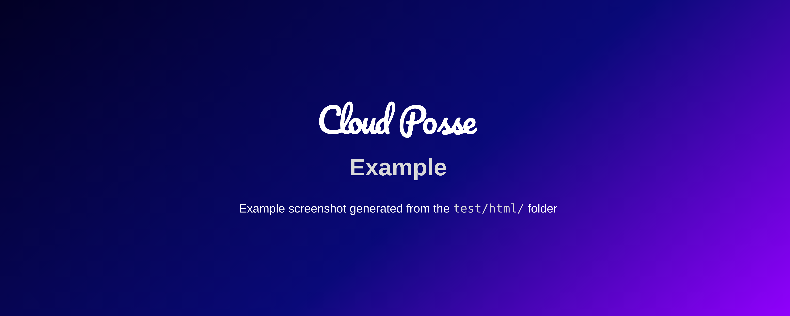

<!-- markdownlint-disable -->
# screenshot <a href="https://cpco.io/homepage?utm_source=github&utm_medium=readme&utm_campaign=cloudposse-github-actions/screenshot&utm_content="></a>
<a href="https://github.com/cloudposse-github-actions/screenshot/releases/latest"></a><a href="https://slack.cloudposse.com"></a>
<!-- markdownlint-restore -->

<!--


  ** DO NOT EDIT THIS FILE
  **
  ** This file was automatically generated by the `cloudposse/build-harness`.
  ** 1) Make all changes to `README.yaml`
  ** 2) Run `make init` (you only need to do this once)
  ** 3) Run`make readme` to rebuild this file.
  **
  ** (We maintain HUNDREDS of open source projects. This is how we maintain our sanity.)
  **


-->

This GitHub Action will use Puppeteer to generate screenshots from any URL or even a `file://`. It's great for creating dynamic banners for GitHub projects.

## Screenshots

*<br/>Example of a screenshot generated by this action from the [`test/html`](test/html) HTML.*


---
> [!NOTE]
> This project is part of Cloud Posse's comprehensive ["SweetOps"](https://cpco.io/homepage?utm_source=github&utm_medium=readme&utm_campaign=cloudposse-github-actions/screenshot&utm_content=) approach towards DevOps.
> <details><summary><strong>Learn More</strong></summary>
>
> It's 100% Open Source and licensed under the [APACHE2](LICENSE).
>
> We have [*dozens of GitHub Actions*](https://github.com/cloudposse-github-actions?utm_source=github&utm_medium=readme&utm_campaign=cloudposse-github-actions/screenshot&utm_content=github_actions) that are Open Source and well-maintained. Check them out!
> </details>

<a href="https://cloudposse.com/readme/header/link?utm_source=github&utm_medium=readme&utm_campaign=cloudposse-github-actions/screenshot&utm_content=readme_header_link"></a>


## Introduction

This action generates a screenshot of any website (including file://) using Puppeteer.


## Usage


> [!IMPORTANT]
> In Cloud Posse's examples, we avoid pinning GitHub Actions to specific versions to prevent discrepancies between the documentation 
> and the latest released versions. However, for your own projects, we strongly advise pinning each GitHub Action to the exact version
> you're using. This practice ensures the stability of your workflows. Additionally, we recommend implementing a systematic 
> approach for updating versions to avoid unexpected changes.


For a complete working example that generated the demo image, see the [`.github/workflows/test.yaml`](.github/workflows/test.yaml) workflow.

```yaml
name: Generate Screenshot

on:
  pull_request:
    types: [opened, synchronize, reopened]

jobs:
  screenshot:
    runs-on: ubuntu-latest
    concurrency:
    group: ${{ github.workflow }}-${{ github.event.pull_request.number || github.ref }}
    cancel-in-progress: true

    steps:
    - uses: actions/checkout@v2
    - name: Run this composite action
      id: screenshot
      uses: cloudposse-github-actions/screenshot@v0
      with:
        url: "file://${{github.workspace}}/test/html/index.html"
        output: "docs/example.png"
        
        # Overwrite any CSS
        css: |
          body {
            background: rgb(2,0,36);
            background: linear-gradient(139deg, rgba(2,0,36,1) 0%, rgba(9,9,121,1) 56%, rgba(147,0,255,1) 100%);
          }

        # Replace any text using JQuery-style CSS path selectors" 
        customizations: |
          "#name": "${{ github.event.repository.name }}"        

        # Set the width & height of the viewport
        viewportWidth: 800
        viewportHeight: 600
 ```


<!-- markdownlint-disable -->

## Inputs

| Name | Description | Default | Required |
|------|-------------|---------|----------|
| consoleOutputEnabled | consoleOutputEnabled | true | false |
| css | Custom CSS overrides | N/A | false |
| customizations | String representation of a YAML or JSON map of CSS paths (key) and replacement (value) | N/A | false |
| deviceScaleFactor | Specifies the device scale factor (pixel ratio) for the web page rendering. It determines how many physical pixels are used to represent a single logical pixel. For example, a device scale factor of 2 means one logical pixel is represented by two physical pixels, commonly used for high-DPI (Retina) displays. A value of 1 uses standard pixel density. This factor affects the resolution and quality of the rendered page or screenshot. | 2 | false |
| fullPage | Screen capture the entire page by scrolling down | false | false |
| imageQuality | Quality of the output image (1-100, applicable for JPEG) | N/A | false |
| omitBackground | Omit the browser default background. Enable to support transparency. | true | false |
| output | Output image file path | screenshot.png | false |
| outputType | Output image type | png | false |
| puppeteerImage | Docker image to run puppeteer. See https://github.com/puppeteer/puppeteer/pkgs/container/puppeteer | ghcr.io/puppeteer/puppeteer:21.7.0 | false |
| url | URL of the HTML content to convert to an image. Use file:// for local files | N/A | true |
| viewportHeight | Viewport height in pixels | N/A | true |
| viewportWidth | Viewport width in pixels | N/A | true |
| waitForTimeout | Number of miliseconds to delay before taking screenshot | 500 | false |


## Outputs

| Name | Description |
|------|-------------|
| file | File containing the generated screenshot |
<!-- markdownlint-restore -->


## Related Projects

Check out these related projects.


## References

For additional context, refer to some of these links.

- [Cloud Posse GitHub Actions](https://docs.cloudposse.com/github-actions/) - A collection of all Cloud Posse managed GitHub Actions


## ✨ Contributing

This project is under active development, and we encourage contributions from our community.
Many thanks to our outstanding contributors:

<a href="https://github.com/cloudposse-github-actions/screenshot/graphs/contributors">
  
</a>

### 🐛 Bug Reports & Feature Requests

Please use the [issue tracker](https://github.com/cloudposse-github-actions/screenshot/issues) to report any bugs or file feature requests.

### 💻 Developing

If you are interested in being a contributor and want to get involved in developing this project or help out with Cloud Posse's other projects, we would love to hear from you! 
Hit us up in [Slack](https://cpco.io/slack?utm_source=github&utm_medium=readme&utm_campaign=cloudposse-github-actions/screenshot&utm_content=slack), in the `#cloudposse` channel.

In general, PRs are welcome. We follow the typical "fork-and-pull" Git workflow.
 1. Review our [Code of Conduct](https://github.com/cloudposse-github-actions/screenshot/?tab=coc-ov-file#code-of-conduct) and [Contributor Guidelines](https://github.com/cloudposse/.github/blob/main/CONTRIBUTING.md).
 2. **Fork** the repo on GitHub
 3. **Clone** the project to your own machine
 4. **Commit** changes to your own branch
 5. **Push** your work back up to your fork
 6. Submit a **Pull Request** so that we can review your changes

**NOTE:** Be sure to merge the latest changes from "upstream" before making a pull request!

### 🌎 Slack Community

Join our [Open Source Community](https://cpco.io/slack?utm_source=github&utm_medium=readme&utm_campaign=cloudposse-github-actions/screenshot&utm_content=slack) on Slack. It's **FREE** for everyone! Our "SweetOps" community is where you get to talk with others who share a similar vision for how to rollout and manage infrastructure. This is the best place to talk shop, ask questions, solicit feedback, and work together as a community to build totally *sweet* infrastructure.

### 📰 Newsletter

Sign up for [our newsletter](https://cpco.io/newsletter?utm_source=github&utm_medium=readme&utm_campaign=cloudposse-github-actions/screenshot&utm_content=newsletter) and join 3,000+ DevOps engineers, CTOs, and founders who get insider access to the latest DevOps trends, so you can always stay in the know.
Dropped straight into your Inbox every week — and usually a 5-minute read.

### 📆 Office Hours <a href="https://cloudposse.com/office-hours?utm_source=github&utm_medium=readme&utm_campaign=cloudposse-github-actions/screenshot&utm_content=office_hours"></a>

[Join us every Wednesday via Zoom](https://cloudposse.com/office-hours?utm_source=github&utm_medium=readme&utm_campaign=cloudposse-github-actions/screenshot&utm_content=office_hours) for your weekly dose of insider DevOps trends, AWS news and GitHub Action insights, all sourced from our SweetOps community, plus a _live Q&A_ that you can’t find anywhere else.
It's **FREE** for everyone!

## About

This project is maintained by <a href="https://cpco.io/homepage?utm_source=github&utm_medium=readme&utm_campaign=cloudposse-github-actions/screenshot&utm_content=">Cloud Posse, LLC</a>.
<a href="https://cpco.io/homepage?utm_source=github&utm_medium=readme&utm_campaign=cloudposse-github-actions/screenshot&utm_content="></a>

We are a [**DevOps Accelerator**](https://cpco.io/commercial-support?utm_source=github&utm_medium=readme&utm_campaign=cloudposse-github-actions/screenshot&utm_content=commercial_support) for funded startups and enterprises.
Use our ready-to-go terraform architecture blueprints for AWS & GitHub Actions to get up and running quickly.
We build it with you. You own everything. Your team wins. Plus, we stick around until you succeed.

<a href="https://cpco.io/commercial-support?utm_source=github&utm_medium=readme&utm_campaign=cloudposse-github-actions/screenshot&utm_content=commercial_support"></a>

*Your team can operate like a pro today.*

Ensure that your team succeeds by using our proven process and turnkey blueprints. Plus, we stick around until you succeed.

<details>
  <summary>📚 <strong>See What's Included</strong></summary>

- **Reference Architecture.** You'll get everything you need from the ground up built using 100% infrastructure as code.
- **Deployment Strategy.** You'll have a battle-tested deployment strategy using GitHub Actions that's automated and repeatable.
- **Site Reliability Engineering.** You'll have total visibility into your apps and microservices.
- **Security Baseline.** You'll have built-in governance with accountability and audit logs for all changes.
- **GitOps.** You'll be able to operate your infrastructure via Pull Requests.
- **Training.** You'll receive hands-on training so your team can operate what we build.
- **Questions.** You'll have a direct line of communication between our teams via a Shared Slack channel.
- **Troubleshooting.** You'll get help to triage when things aren't working.
- **Code Reviews.** You'll receive constructive feedback on Pull Requests.
- **Bug Fixes.** We'll rapidly work with you to fix any bugs in our projects.
</details>

<a href="https://cloudposse.com/readme/commercial-support/link?utm_source=github&utm_medium=readme&utm_campaign=cloudposse-github-actions/screenshot&utm_content=readme_commercial_support_link"></a>
## License

<a href="https://opensource.org/licenses/Apache-2.0"></a>

<details>
<summary>Preamble to the Apache License, Version 2.0</summary>
<br/>
<br/>

Complete license is available in the [`LICENSE`](LICENSE) file.

```text
Licensed to the Apache Software Foundation (ASF) under one
or more contributor license agreements.  See the NOTICE file
distributed with this work for additional information
regarding copyright ownership.  The ASF licenses this file
to you under the Apache License, Version 2.0 (the
"License"); you may not use this file except in compliance
with the License.  You may obtain a copy of the License at

  https://www.apache.org/licenses/LICENSE-2.0

Unless required by applicable law or agreed to in writing,
software distributed under the License is distributed on an
"AS IS" BASIS, WITHOUT WARRANTIES OR CONDITIONS OF ANY
KIND, either express or implied.  See the License for the
specific language governing permissions and limitations
under the License.
```
</details>

## Trademarks

All other trademarks referenced herein are the property of their respective owners.
---
Copyright © 2017-2024 [Cloud Posse, LLC](https://cpco.io/copyright)


<a href="https://cloudposse.com/readme/footer/link?utm_source=github&utm_medium=readme&utm_campaign=cloudposse-github-actions/screenshot&utm_content=readme_footer_link"></a>


