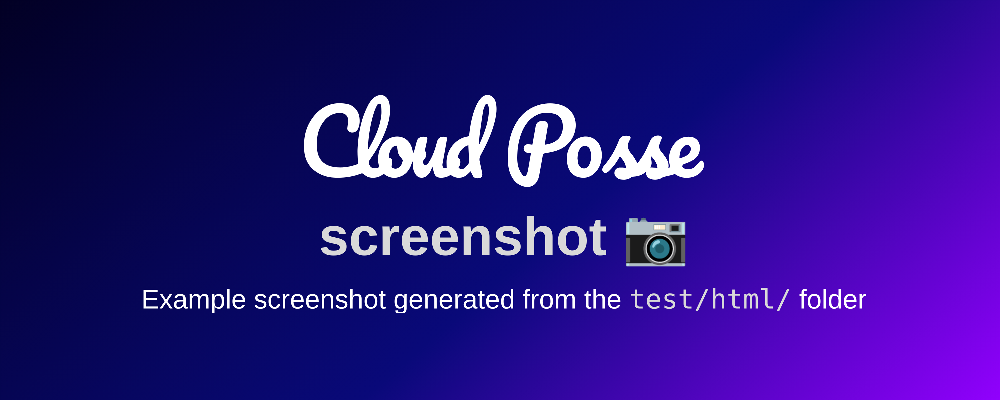

<!-- markdownlint-disable -->
# screenshot<a href="https://cpco.io/homepage"></a> [](https://github.com/cloudposse-github-actions/screenshot/releases/latest) [](https://slack.cloudposse.com)
<!-- markdownlint-restore -->


<!--


  ** DO NOT EDIT THIS FILE
  **
  ** This file was automatically generated by the `build-harness`.
  ** 1) Make all changes to `README.yaml`
  ** 2) Run `make init` (you only need to do this once)
  ** 3) Run`make readme` to rebuild this file.
  **
  ** (We maintain HUNDREDS of open source projects. This is how we maintain our sanity.)
  **


-->

This GitHub Action will use Puppeteer to generate screenshots from any URL or even a `file://`. It's great for creating dynamic banners for GitHub projects.

---
> [!NOTE]
> This project is part of Cloud Posse's comprehensive ["SweetOps"](https://cpco.io/sweetops) approach towards DevOps.
>
> It's 100% Open Source and licensed under the [APACHE2](LICENSE).
>

[![README Header][readme_header_img]][readme_header_link]


## Screenshots



*<br/>Example of running a screenshot generated by this action from the [`test/html`](test/html) HTML.*


## Introduction

This action generates a screenshot of any website (including file://) using Puppeteer.


## Usage


For a complete working example that generated the demo image, see the [`.github/workflows/test.yaml`](.github/workflows/test.yaml) workflow.

```yaml
name: Generate Screenshot

on:
  pull_request:
    types: [opened, synchronize, reopened]

jobs:
  screenshot:
    runs-on: ubuntu-latest
    concurrency:
    group: ${{ github.workflow }}-${{ github.event.pull_request.number || github.ref }}
    cancel-in-progress: true

    steps:
    - uses: actions/checkout@v2
    - name: Run this composite action
      id: screenshot
      uses: cloudposse-github-actions/screenshot@v0
      with:
        url: "file://${{github.workspace}}/test/html/index.html"
        output: "docs/example.png"
        
        # Overwrite any CSS
        css: |
          body {
            background: rgb(2,0,36);
            background: linear-gradient(139deg, rgba(2,0,36,1) 0%, rgba(9,9,121,1) 56%, rgba(147,0,255,1) 100%);
          }

        # Replace any text using JQuery-style CSS path selectors" 
        customizations: |
          "#name": "${{ github.event.repository.name }}"        

        # Set the width & height of the viewport
        viewportWidth: 800
        viewportHeight: 600
 ```


<!-- markdownlint-disable -->

## Inputs

| Name | Description | Default | Required |
|------|-------------|---------|----------|
| consoleOutputEnabled | consoleOutputEnabled | true | false |
| css | Custom CSS overrides | N/A | false |
| customizations | String representation of a YAML or JSON map of CSS paths (key) and replacement (value) | N/A | false |
| deviceScaleFactor | Specifies the device scale factor (pixel ratio) for the web page rendering. It determines how many physical pixels are used to represent a single logical pixel. For example, a device scale factor of 2 means one logical pixel is represented by two physical pixels, commonly used for high-DPI (Retina) displays. A value of 1 uses standard pixel density. This factor affects the resolution and quality of the rendered page or screenshot. | 2 | false |
| fullPage | Screen capture the entire page by scrolling down | false | false |
| imageQuality | Quality of the output image (1-100, applicable for JPEG) | N/A | false |
| omitBackground | Omit the browser default background. Enable to support transparency. | true | false |
| output | Output image file path | screenshot.png | false |
| outputType | Output image type | png | false |
| url | URL of the HTML content to convert to an image. Use file:// for local files | N/A | true |
| viewportHeight | Viewport height in pixels | N/A | true |
| viewportWidth | Viewport width in pixels | N/A | true |
| waitForTimeout | Number of miliseconds to delay before taking screenshot | 500 | false |


## Outputs

| Name | Description |
|------|-------------|
| file | File containing the generated screenshot |
<!-- markdownlint-restore -->


## Related Projects

Check out these related projects.


## References

For additional context, refer to some of these links.

- [Cloud Posse GitHub Actions](https://docs.cloudposse.com/github-actions/) - A collection of all Cloud Posse managed GitHub Actions


## ✨ Contributing

This project is under active development, and we encourage contributions from our community. 
Many thanks to our outstanding contributors:

<a href="https://github.com/cloudposse-github-actions/screenshot/graphs/contributors">
  
</a>

### 🐛 Bug Reports & Feature Requests

Please use the [issue tracker](https://github.com/cloudposse-github-actions/screenshot/issues) to report any bugs or file feature requests.

### 💻 Developing

If you are interested in being a contributor and want to get involved in developing this project or [help out](https://cpco.io/help-out) with Cloud Posse's other projects, we would love to hear from you! Shoot us an [email][email].

In general, PRs are welcome. We follow the typical "fork-and-pull" Git workflow.

 1. **Fork** the repo on GitHub
 2. **Clone** the project to your own machine
 3. **Commit** changes to your own branch
 4. **Push** your work back up to your fork
 5. Submit a **Pull Request** so that we can review your changes

**NOTE:** Be sure to merge the latest changes from "upstream" before making a pull request!

### 🌎 Slack Community

Join our [Open Source Community][slack] on Slack. It's **FREE** for everyone! Our "SweetOps" community is where you get to talk with others who share a similar vision for how to rollout and manage infrastructure. This is the best place to talk shop, ask questions, solicit feedback, and work together as a community to build totally *sweet* infrastructure.

### 📰 Newsletter

Sign up for [our newsletter][newsletter] that covers everything on our technology radar.  Receive updates on what we're up to on GitHub as well as awesome new projects we discover.

### 📆 Office Hours 

[Join us every Wednesday via Zoom][office_hours] for our weekly "Lunch & Learn" sessions. It's **FREE** for everyone!

## About 

This project is maintained and funded by [Cloud Posse, LLC][website]. 
<a href="https://cpco.io/homepage"></a>

We are a [**DevOps Accelerator**][commercial_support]. We'll help you build your cloud infrastructure from the ground up so you can own it. Then we'll show you how to operate it and stick around for as long as you need us.

[][commercial_support]

Work directly with our team of DevOps experts via email, slack, and video conferencing.

We deliver 10x the value for a fraction of the cost of a full-time engineer. Our track record is not even funny. If you want things done right and you need it done FAST, then we're your best bet.

- **Reference Architecture.** You'll get everything you need from the ground up built using 100% infrastructure as code.
- **Release Engineering.** You'll have end-to-end CI/CD with unlimited staging environments.
- **Site Reliability Engineering.** You'll have total visibility into your apps and microservices.
- **Security Baseline.** You'll have built-in governance with accountability and audit logs for all changes.
- **GitOps.** You'll be able to operate your infrastructure via Pull Requests.
- **Training.** You'll receive hands-on training so your team can operate what we build.
- **Questions.** You'll have a direct line of communication between our teams via a Shared Slack channel.
- **Troubleshooting.** You'll get help to triage when things aren't working.
- **Code Reviews.** You'll receive constructive feedback on Pull Requests.
- **Bug Fixes.** We'll rapidly work with you to fix any bugs in our projects.

[![README Commercial Support][readme_commercial_support_img]][readme_commercial_support_link]
## License

[](https://opensource.org/licenses/Apache-2.0)

See [LICENSE](LICENSE) for full details.

```text
Licensed to the Apache Software Foundation (ASF) under one
or more contributor license agreements.  See the NOTICE file
distributed with this work for additional information
regarding copyright ownership.  The ASF licenses this file
to you under the Apache License, Version 2.0 (the
"License"); you may not use this file except in compliance
with the License.  You may obtain a copy of the License at

  https://www.apache.org/licenses/LICENSE-2.0

Unless required by applicable law or agreed to in writing,
software distributed under the License is distributed on an
"AS IS" BASIS, WITHOUT WARRANTIES OR CONDITIONS OF ANY
KIND, either express or implied.  See the License for the
specific language governing permissions and limitations
under the License.
```

## Trademarks

All other trademarks referenced herein are the property of their respective owners.
---
Copyright © 2017-2024 [Cloud Posse, LLC](https://cpco.io/copyright)
[![README Footer][readme_footer_img]][readme_footer_link]
[![Beacon][beacon]][website]
<!-- markdownlint-disable -->
  [logo]: https://cloudposse.com/logo-300x69.svg
  [docs]: https://cpco.io/docs?utm_source=github&utm_medium=readme&utm_campaign=cloudposse-github-actions/screenshot&utm_content=docs
  [website]: https://cpco.io/homepage?utm_source=github&utm_medium=readme&utm_campaign=cloudposse-github-actions/screenshot&utm_content=website
  [github]: https://cpco.io/github?utm_source=github&utm_medium=readme&utm_campaign=cloudposse-github-actions/screenshot&utm_content=github
  [jobs]: https://cpco.io/jobs?utm_source=github&utm_medium=readme&utm_campaign=cloudposse-github-actions/screenshot&utm_content=jobs
  [hire]: https://cpco.io/hire?utm_source=github&utm_medium=readme&utm_campaign=cloudposse-github-actions/screenshot&utm_content=hire
  [slack]: https://cpco.io/slack?utm_source=github&utm_medium=readme&utm_campaign=cloudposse-github-actions/screenshot&utm_content=slack
  [twitter]: https://cpco.io/twitter?utm_source=github&utm_medium=readme&utm_campaign=cloudposse-github-actions/screenshot&utm_content=twitter
  [office_hours]: https://cloudposse.com/office-hours?utm_source=github&utm_medium=readme&utm_campaign=cloudposse-github-actions/screenshot&utm_content=office_hours
  [newsletter]: https://cpco.io/newsletter?utm_source=github&utm_medium=readme&utm_campaign=cloudposse-github-actions/screenshot&utm_content=newsletter
  [email]: https://cpco.io/email?utm_source=github&utm_medium=readme&utm_campaign=cloudposse-github-actions/screenshot&utm_content=email
  [commercial_support]: https://cpco.io/commercial-support?utm_source=github&utm_medium=readme&utm_campaign=cloudposse-github-actions/screenshot&utm_content=commercial_support
  [we_love_open_source]: https://cpco.io/we-love-open-source?utm_source=github&utm_medium=readme&utm_campaign=cloudposse-github-actions/screenshot&utm_content=we_love_open_source
  [terraform_modules]: https://cpco.io/terraform-modules?utm_source=github&utm_medium=readme&utm_campaign=cloudposse-github-actions/screenshot&utm_content=terraform_modules
  [readme_header_img]: https://cloudposse.com/readme/header/img
  [readme_header_link]: https://cloudposse.com/readme/header/link?utm_source=github&utm_medium=readme&utm_campaign=cloudposse-github-actions/screenshot&utm_content=readme_header_link
  [readme_footer_img]: https://cloudposse.com/readme/footer/img
  [readme_footer_link]: https://cloudposse.com/readme/footer/link?utm_source=github&utm_medium=readme&utm_campaign=cloudposse-github-actions/screenshot&utm_content=readme_footer_link
  [readme_commercial_support_img]: https://cloudposse.com/readme/commercial-support/img
  [readme_commercial_support_link]: https://cloudposse.com/readme/commercial-support/link?utm_source=github&utm_medium=readme&utm_campaign=cloudposse-github-actions/screenshot&utm_content=readme_commercial_support_link
  [beacon]: https://ga-beacon.cloudposse.com/UA-76589703-4/cloudposse-github-actions/screenshot?pixel&cs=github&cm=readme&an=screenshot
<!-- markdownlint-restore -->
